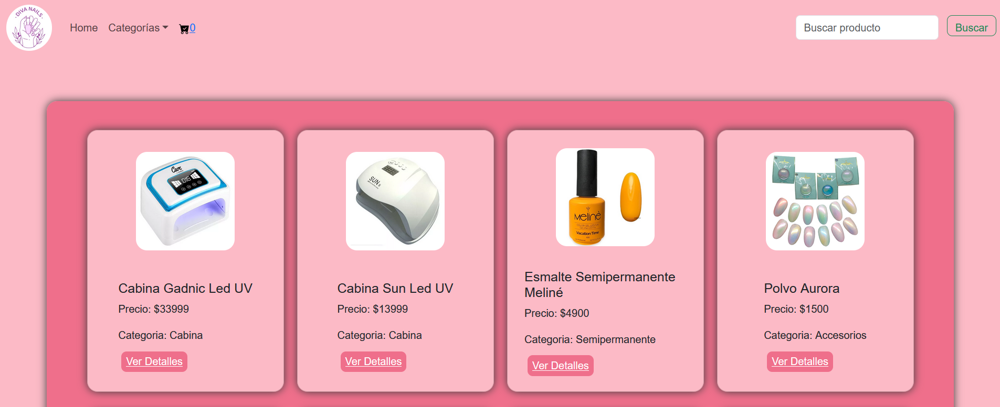
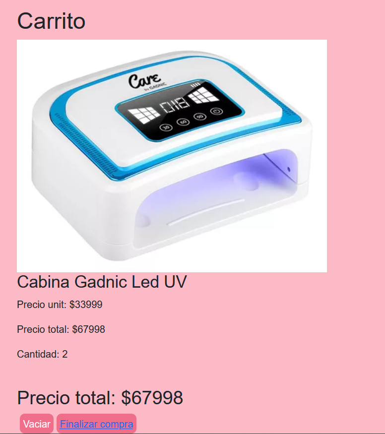

# Diva Nails Shop

Bienvenido a la tienda de Diva Nails donde encontrarás una amplia selección de productos para embellecer tus uñas. Nuestra tienda está construida con React y utiliza Firebase Firestore para gestionar los datos. Además, hemos utilizado Bootstrap para garantizar un diseño elegante y receptivo.

## Contenido

- [Capturas de Pantalla](#capturas-de-pantalla)
- [Características](#características)
- [Instalación](#instalación)
- [Uso](#uso)
- [Tecnologías Utilizadas](#tecnologías-utilizadas)
- [Contribuciones](#contribuciones)
- [Licencia](#licencia)

## Capturas de Pantalla

## Características

- Catálogo de productos de esmalte tradicional, semipermanente, accesorios y cabinas.
- Interfaz de usuario intuitiva y atractiva.
- Integración con Firebase Firestore para gestionar la base de datos.
- Diseño receptivo gracias a Bootstrap.

## Instalación

1. Clona el repositorio: `git clone https://github.com/tu-usuario/tu-repositorio.git`
2. Instala las dependencias: `npm install`
3. Configura las credenciales de Firebase en el archivo `.env`: [Consultar por credenciales]

# 1.- Inicia la aplicación: npm start

.Uso

Explora la tienda, añade productos a tu carrito y disfruta de una experiencia de compra única.
Tecnologías Utilizadas

    React
    Bootstrap
    Firebase Firestore

.Contribuciones

¡Contribuciones son bienvenidas! Si encuentras algún problema o tienes alguna mejora, por favor abre un problema o envía una solicitud de extracción.

.Licencia

Este proyecto está bajo la Licencia ©Creative Commons. Ver el archivo LICENSE.md para más detalles.